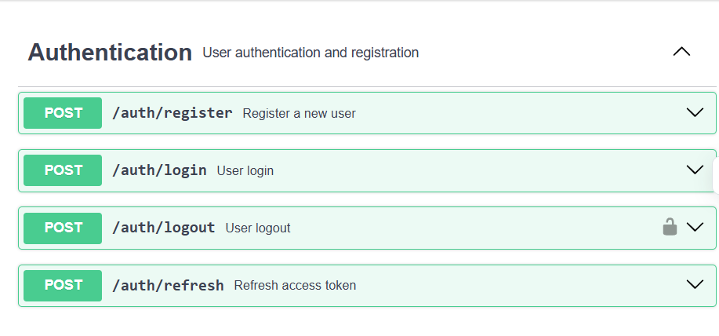
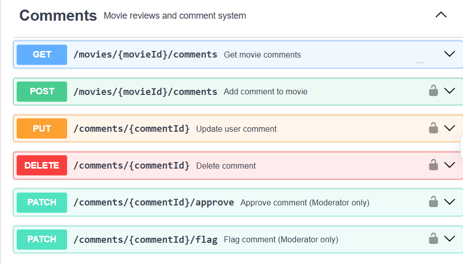
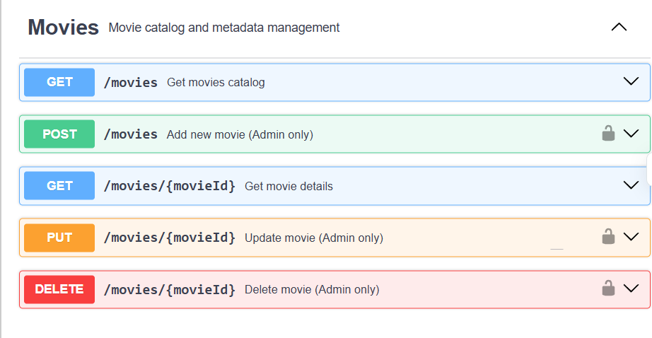
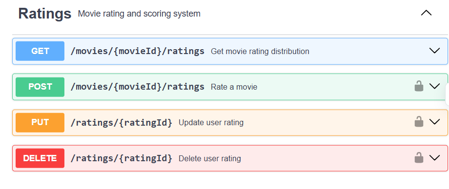
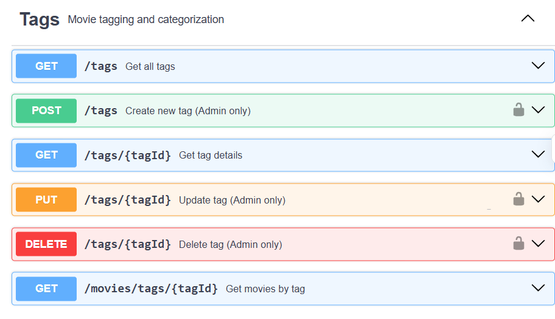
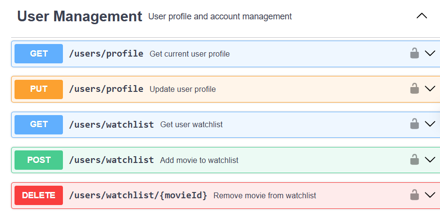

# Movie Review Platform  

## Functional Requirements

### User Management

- **As a user**, I want to register using my email, username, and password, so I can create an account.  
- **As an authenticated user**, I want to log in and log out securely, so my account remains safe.  
- **As an authenticated user**, I want to view and update my profile, so I can manage my personal information.  
- **As an authenticated user**, I want to add or remove movies from my watchlist, so I can keep track of what I want to watch.

---

### Movie Management

- **As a user**, I want to see a catalog of movies with details (title, description, genre, cast, etc.), so I can explore new content.  
- **As a user**, I want to search for movies by title, genre, year, or director, so I can find specific ones easily.  
- **As an authenticated user**, I want the movie listings to be paginated, so I can browse them conveniently.  
- **As an admin**, I want to add, update, and delete movies, so I can manage the platform content.  
- **As a user**, I want the system to sync movie data with external movie databases, so I get the most recent information.

---

### Rating & Review System

- **As an authenticated user**, I want to rate movies on a scale from 1 to 10, so I can express how much I liked them.  
- **As an authenticated user**, I want to write and edit text reviews for movies, so I can share detailed opinions.  
- **As a user**, I want the system to calculate and display average ratings for each movie, so I can judge popularity.  
- **As a user**, I want to view the rating distribution, so I can understand how people rated a movie.  
- **As an authenticated user**, I want to update or delete my own ratings, so I can change my input if necessary.

---

### Comment System

- **As an authenticated user**, I want to comment on movies, so I can join discussions.  
- **As an authenticated**, I want to edit or delete my own comments, so I can make corrections.  
- **As a moderator**, I want to approve, reject, or flag comments, so I can maintain quality and safety.  
- **As an authenticated user**, I want comments to be displayed with user info and timestamps, so I know who wrote them and when.

---

### Tag Management

- **As a user**, I want movies to be categorized using tags, so I can explore by themes.  
- **As a user**, I want to search movies by tags, so I can filter content.  
- **As an admin**, I want to create and manage tags, so the tag system remains organized.  
- **As a user/admin**, I want the system to track tag usage statistics, so I can see trending topics.

---

## Non-Functional Requirements

### Performance

- Movie search results should load within 3 seconds.  
- The system should support at least 100 concurrent users.  
- API response time should be under 2 seconds for basic operations.

---

### Security

- User passwords must be encrypted or hashed.  
- Only authenticated users can create ratings and comments.  
- User sessionsshould expire after a period of inactivity.

---

### Usability

- The UI must work on both desktop and mobile devices.  
- The system must provide clear error messages for user actions.  
- The movie search experience must be intuitive and easy to use.

---

### Reliability

- The system must handle invalid user input gracefully without crashing.  
- Database connection errors must be managed and logged appropriately.  
- External API failures should not affect core system functionality.

---

### Compatibility

- The system must work on modern web browsers (Chrome, Firefox, Safari).  
- The system must be able to integrate with external movie databases.

## OpenAPI

